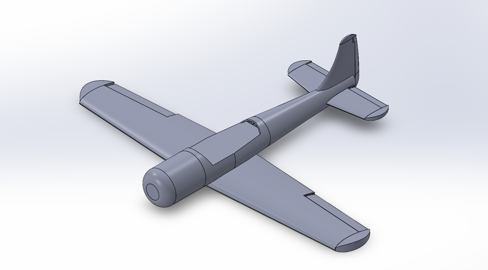

# Introduction
Hi, I'm Shadab, and this is my design of an RC Plane inspired by the WWII german fighter plane, the Focke Wulf Dw 190 D-9. Empty body weight is just under 400g so far. 

# SolidWorks RC Plane Model
The entire plane's assembly with all subassemblies can be downloaded from Final-Aircraft.zip, found in Parts/Aircraft. Otherwise, each subassembly can be acquired individually by downloading their respective zip folders.

